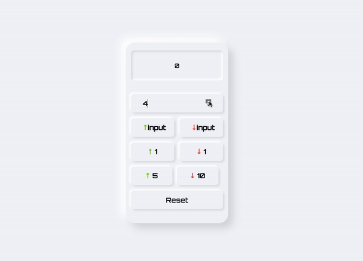

# Counter
Welcome to Counter - the most fun and exciting way to increment and decrement values! This microproject lets you increment and decrement a value by 1, 5, and 10, and even allows you to input your own value to increment or decrement by. Plus, it features a sleek and modern Neumorphic design that's sure to impress!

## Features
- Increment and decrement a value by 1, 5, and 10 - just click the buttons and watch the magic happen!
- Feeling adventurous? Enter your own value into the input field and click the "Add" or "Subtract" button to increment or decrement the value by that amount.
- Neumorphic design implemented using CSS - this design is so cool, it's like you're using a time machine to visit the future!
- Responsive design - use the microproject on your computer, tablet, or phone - it looks great no matter where you are!

## Getting Started

To get started with this project, just follow these simple steps:

1. Clone the repository and open the index.html file in your web browser.
2. Get ready for the most exciting and fun way to increment and decrement values that you've ever experienced!

## Usage

Once you have the project open in your web browser, the fun can begin! Use the buttons provided to increment or decrement the value by 1, 5, or 10. Feeling bold? Enter a value into the input field and click the "Add" or "Subtract" button to increment or decrement the value by that amount. The possibilities are endless!

## Screenshot

## Credits

The Neumorphic design was inspired by the work of [Michal Malewicz](https://twitter.com/michalmalewicz) - thanks for the awesome inspiration!
